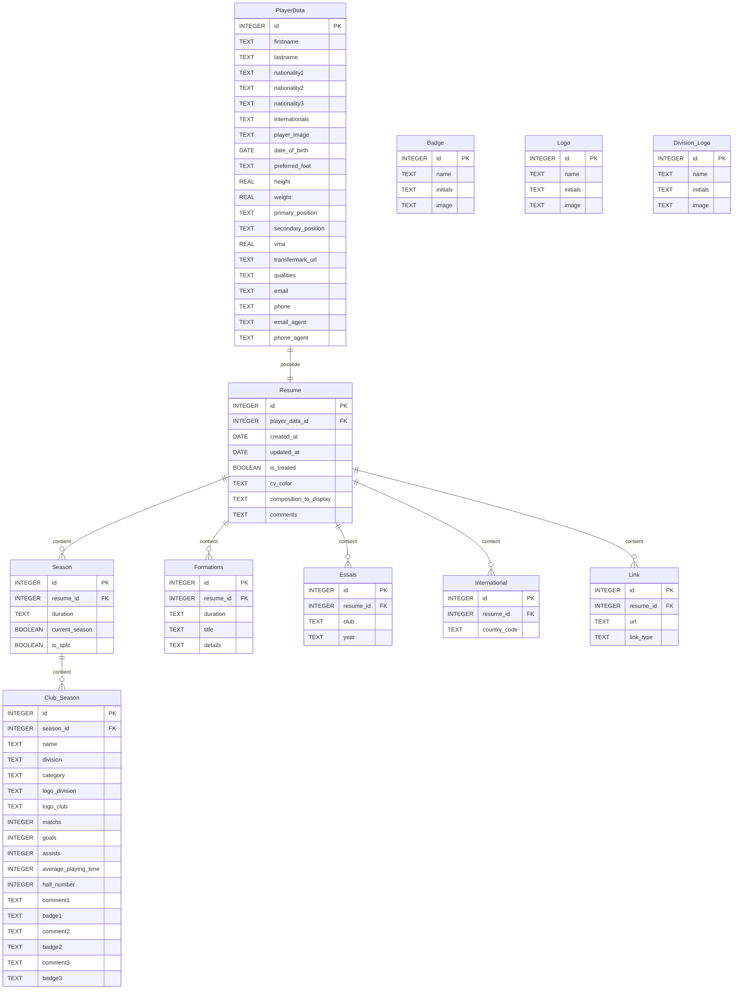
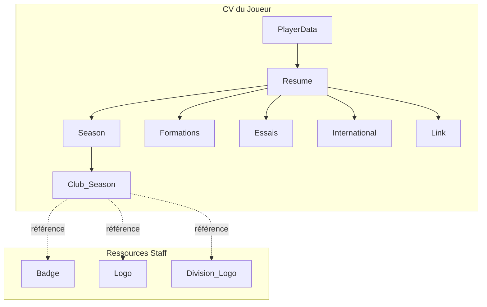

# Schéma de Base de Données - Scoutify

## Diagramme Entité-Relation

## Description des tables

### Tables principales (CV)

- **PlayerData** — Informations personnelles du joueur (identité, nationalités, mensurations, contact)
- **Resume** — CV du joueur avec ses préférences d'affichage (couleur, composition)
- **Season** — Saison sportive (peut être divisée en 2 clubs)
- **Club_Season** — Détails et statistiques pour un club dans une saison
- **Formations** — Parcours de formation sportive
- **Essais** — Essais effectués dans d'autres clubs
- **International** — Sélections internationales (U19, U21, etc.)
- **Link** — Liens externes (vidéos, réseaux sociaux)

### Tables de ressources (Staff)

- **Badge** — Badges/distinctions attribuables aux saisons
- **Logo** — Logos des clubs
- **Division_Logo** — Logos des championnats/divisions

## Relations

## Cardinalités

- Un **PlayerData** possède exactement un **Resume** (1:1)
- Un **Resume** peut avoir plusieurs **Season** (1:N)
- Une **Season** peut avoir 1 ou 2 **Club_Season** (saison normale ou split)
- Un **Resume** peut avoir plusieurs **Formations**, **Essais**, **International**, **Link** (1:N)
